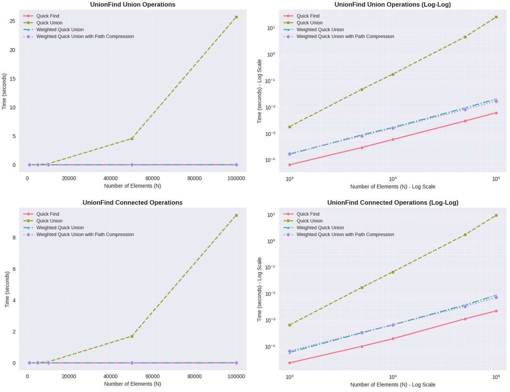
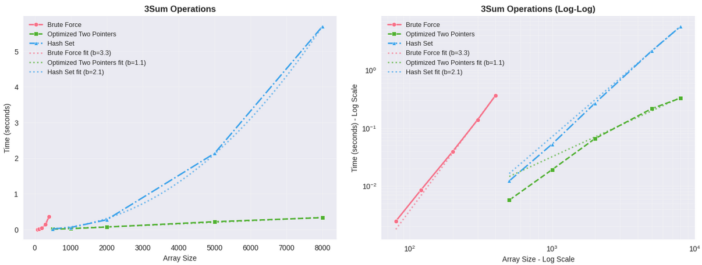

# Rapport - Programmeringsuppgift 1

## Inledning

För den här uppgiften har jag valt att dela upp implementation och analys i separata delar. Själva algoritmerna finns implementerade i separata Python-filer under projektets `src`-katalog, medan alla tester, mätningar och visualiseringar görs i en Jupyter-notebook. Denna uppdelning gör att algoritmkoden kan hållas ren och återanvändbar, samtidigt som notebooken fokuserar på experiment, körningar och presentation av resultat.

Notebooken innehåller både mätmetodik (via `%timeit` och closures), datainsamling till tabeller och DataFrames samt visualiseringar i form av grafer. På så sätt kan jag tydligt visa hur komplexiteten utvecklas för de olika varianterna när inputstorleken växer.

Utöver detta har jag lagt till separata testmöjligheter för algoritmimplementationerna, så att jag kunde köra enkla “smoke tests” under utvecklingen. Det gjorde det lättare att snabbt verifiera att varje variant fungerade korrekt innan jag gick vidare med mätningar och analyser.

För en mer detaljerad beskrivning av projektets kodstruktur och funktionernas uppbyggnad hänvisar jag till dokumentet [code\_implementation\_guide.md](code_implementation_guide.md) i projektets rotkatalog. Det är ett genererat dokument på engelska som beskriver implementationerna mer utförligt.

> För vägledning kring hur man sätter upp miljön och kör algoritmerna och testerna hänvisar jag till [README](README.md).

## Uppgift 1: Implementera första varianten av Union Find (Quick Find)

**Beskrivning**
I Quick Find har varje element ett komponent-id (lagrat i en array) som anger vilken komponent det tillhör. Det bygger alltså på en tabell där index är elementet och värdet är dess komponent-id, och genom att index kopplas till nya id:n så skapas nya unioner.

Quick Find används sannolikt som startpunkt för att den är enkel att förstå, implementera och analysera, även om den snabbt blir ineffektiv för stora N.

**Operationer**
* `connected(p, q)` är mycket snabb: en jämförelse av två arrayvärden → O(1).
* `union(p, q)` är kostsam: man måste gå igenom hela arrayen och uppdatera alla positioner som har samma komponent-id som `p` → O(N).

**Visualisering**
Se fullständiga mätvärden, beräkningar och subplots för respektive variant i [notebooks/reports/algorithm_analysis_2025-09-21_21_59.html](notebooks/reports/algorithm_analysis_2025-09-21_21_59.html).

## Uppgift 2: Förbättra Union-Find (Quick Union, Weighted, Path Compression)

**Val av implementationer**
Enligt uppgiften räckte det att implementera *en* snabbare variant, men jag valde att implementera samtliga förslag, dvs *Quick Union*, *Weighted Quick Union* och *Weighted Quick Union med Path Compression* för att jag tyckte att det var en intressant och lärorik utmaning, men också för att det ger en mer pedagogisk jämförelse, och visar steg för steg hur förbättringar förändrar prestanda.

**Beskrivning**
* Quick Union: Representerar komponenter som träd på rotnoder, där varje nod pekar på en förälder. Roten representerar hela komponenten. Nackdelen är att träden bygger på vertikalt, vilket gör att `connected` tar lång tid i värsta fall.
* Weighted Quick Union: Förbättrar genom att alltid hänga det mindre trädet under det större. Effekten blir att träden hålls bredare men grundare, så sökvägarna blir kortare och både `union` och `connected` går snabbare (≈ O(log N)).
* Weighted Quick Union med Path Compression: Här gör jag dessutom så att när `connected` körs pekar alla traverserade noder om direkt mot roten. Träden blir då nästan platta över tid. Det betyder att både `union` och `connected` i praktiken tar konstant tid, även för stora N.

**Visualisering**
Se fullständiga mätvärden, beräkningar och subplots för respektive variant i [notebooks/reports/algorithm_analysis_2025-09-21_21_59.html](notebooks/reports/algorithm_analysis_2025-09-21_21_59.html).

Se grafisk representation under Uppgift 3 nedan.

## Uppgift 3: Testa Union Find

**Metodik**
* Storlekar: N = 1 000, 5 000, 10 000, 50 000, 100 000 för att tydligt kunna se skillnader i tillväxt.
* Antal operationer: ≈ 0,9·N union-operationer per test. Jag valde detta för att arbetsmängden ska skala med N. Med 0,9·N når jag en arbetslast som är stor nog för att visa effekterna men undviker att alla element blir ihopkopplade direkt. Detta har jag uppfattat är vanligt förekommande och det gör testen mer representativa.
* Mätmetod: I testimplementationen använde jag closures för att kapsla in både datastruktur och operationer. Det betyder att jag mäter just det jag vill (union- eller connected-anrop), utan att inkludera setup varje gång. Fördelen är renare mätvärden. Nackdelen är att strukturen förändras mellan upprepningar: efter första körningen är fler element redan kopplade. Men eftersom alla algoritmer mäts på samma sätt är jämförelsen rättvis.

**Resultat**
Tabellen nedan visar empiriska lutningar från log-log-analysen, tillsammans med den teoretiskt förväntade komplexiteten:

| Operation | Algoritm                    | Lutning (empiri) | Förväntad komplexitet |
| --------- | --------------------------- | ---------------- | --------------------- |
| Union     | Quick Find                  | 0,99             | O(N)                  |
|           | Quick Union                 | 2,08             | O(N) i värsta fall    |
|           | Weighted Quick Union        | 1,05             | O(log N)              |
|           | Weighted + Path Compression | 1,00             | \~O(1) i praktiken    |
| Connected | Quick Find                  | 0,99             | O(1)                  |
|           | Quick Union                 | 2,08             | O(N) i värsta fall    |
|           | Weighted Quick Union        | 1,08             | O(log N)              |
|           | Weighted + Path Compression | 1,02             | \~O(1) i praktiken    |

**Tolkning**
Resultaten stämmer nära det jag förväntade. Quick Union växer mycket snabbare än de andra när N blir stort eftersom träden kan bli djupa. Weighted och Path Compression håller träden grunda och kurvor som nästan inte stiger alls i log-log-diagrammen. Det intressanta är att redan vid relativt små N som 50 000–100 000 syns att Path Compression i praktiken beter sig som konstant tid. Det visar att förbättringarna fungerar mycket bra i Python även för måttliga teststorlekar.

**Visualisering**
Se fullständiga mätvärden, beräkningar och subplots för respektive variant i [notebooks/reports/algorithm_analysis_2025-09-21_21_59.html](notebooks/reports/algorithm_analysis_2025-09-21_21_59.html).

## Uppgift 4: Implementera 3Sum (Brute Force, O(N³))

**Beskrivning**
Jag implementerade en brute force-lösning som testar alla tripplar av element. Med “rak lösning” menar jag här den mest direkta implementationen utan optimering: tre nästlade loopar. Alternativet är att utnyttja strukturer eller sökstrategier som reducerar antalet loopar (vilket jag gör i nästa uppgift).

**Resultat**
Vid mätningar på N=80–400 syns tydlig kubisk tillväxt. Log-log-analysen ger lutning ≈ 3,10, vilket matchar den teoretiska O(N³).

**Visualisering**
Se fullständiga mätvärden, beräkningar och subplots för respektive variant i [notebooks/reports/algorithm_analysis_2025-09-21_21_59.html](notebooks/reports/algorithm_analysis_2025-09-21_21_59.html).

Se grafisk representation under Uppgift 6 nedan.

## Uppgift 5: Förbättra 3Sum

**Val av förbättringar**
Jag implementerade två varianter som diskuterades på föreläsningarna:

1. Two Pointers (på sorterad array): Jag sorterar arrayen och använder två pekare för att röra mig inåt från båda håll. På så sätt kan jag avgöra om summan är för stor eller för liten och flytta rätt pekare. Detta reducerar problemet från tre loopar till två. Trade-off: sorteringen kostar O(N log N), men den domineras snabbt av den kvadratiska delen O(N²). Two Pointers har också den intressanta egenskapen att overhead och sortering gör att den ibland ser snabbare ut än strikt kvadratisk vid små till medelstora N. Detta analyseras mer ingående i Uppgift 6.

2. Hash Set-variant: För varje valt första element (i) bygger jag ett hash-set av redan sedda tal. Sedan kan jag snabbt kontrollera om det kompletterande talet för en triplet finns. Trade-off: metoden kräver O(N) extra minne och har viss overhead för hashning, men ersätter en inre loop med effektiva uppslag. Den totala tidskomplexiteten blir fortfarande O(N²), men i praktiken minskar antalet jämförelser jämfört med brute force.

**Resultat**
Båda metoderna visar kvadratisk tillväxt istället för kubisk, vilket gör att de klarar mycket större inputstorlekar. Two Pointers är generellt snabbast i mina mätningar, medan Hash Set ligger nära den teoretiska kvadratiska kostnaden men med högre konstanter.

**Visualisering.**
Se fullständiga mätvärden, beräkningar och subplots för respektive variant i [notebooks/reports/algorithm_analysis_2025-09-21_21_59.html](notebooks/reports/algorithm_analysis_2025-09-21_21_59.html).

Se grafisk representation under Uppgift 6 nedan.

## Uppgift 6: Testa 3Sum

**Metodik**
Brute Force testades på N = 80–400, medan Two Pointers och Hash Set kördes på N = 500–8000. För att fånga algoritmernas faktiska tillväxt använde jag `curve_fit` för att uppskatta exponenten p i modellen T ≈ c·N^p.  Jag valde att lägga till denna anpassning specifikt för 3Sum eftersom det ger en mer nyanserad analys. Two Pointers visade ett mer komplext beteende än de andra, därför lade jag till en extra anpassning som fokuserar på de större inputstorlekarna där den teoretiska kvadratiska skalningen blir tydligast. Två konstanter styr logiken:

* `MIN_FITTING_POINTS = 2` → minsta antal punkter för att en anpassning ska göras.
* `MIN_LARGE_POINTS = 3` → minsta antal punkter för att försöka en separat anpassning på de större N-värdena.

Jag använder kurvanpassning endast för 3Sum. Union-Find har redan välkända analytiska komplexiteter som syns direkt i graferna, medan 3Sum är mer känslig för konstanta faktorer och preprocessning (t.ex. sortering). Därför tänker jag att exponentanpassning är mer användbar just här.

**Resultat**
* Brute Force: Lutning ≈ 3,10 → tydligt kubisk tillväxt.
* Two Pointers: Lutning ≈ 1,46 över hela spannet, men när större N analyseras separat närmar sig resultatet en kvadratisk profil.
* Hash Set: Lutning ≈ 2,22 → nära kvadratisk men något högre på grund av overhead.

**Fördjupad analys av Two Pointers**
Two Pointers visar ett mer komplext beteende än en ren O(N²)-kurva:

* Tidiga storlekar (500–2000): Tiden ökar med faktor \~3,4 vid fördubbling, vilket är lägre än den teoretiska 4× för O(N²). Här påverkar fasta overheadkostnader och sorteringens effektivitet mätningarna.
* Större storlekar (5000–8000): Tiden växer mer i linje med kvadratisk skalning, men fortfarande något under de teoretiska multiplikatorerna.

Det betyder att algoritmen först ser snabbare ut än kvadratisk eftersom overhead dominerar, och därefter framträder det kvadratiska beteendet tydligare när N växer.

**Tänkbara orsaker:**
1. Minnes- och cacheeffekter gör större arrayer mer effektiva än väntat.
2. Pythons Timsort utnyttjar redan sorterade sekvenser, vilket gör sorteringen effektivare vid större N.
3. Implementationens overhead märks mest vid små N men försvinner i större skala.
4. Two pointer-metoden utnyttjar datans ordning, vilket kan ge kortare iterationer.

**Slutsats**
Two Pointers följer i grunden O(N²), men mätningarna visar att verklig prestanda inte alltid kan fångas i en enkel potenslag. Genom att använda anpassning för hela spannet och storleksanpassad mätning kan jag visa hur exponenten ser lägre ut vid små N men närmar sig 2 när inputstorleken ökar.

Den här specialhanteringen behövs bara för Two Pointers, eftersom Brute Force konsekvent är kubisk och Hash Set konsekvent är kvadratisk.

**Visualisering**
Se fullständiga mätvärden, beräkningar och subplots för respektive variant i [notebooks/reports/algorithm_analysis_2025-09-21_21_59.html](notebooks/reports/algorithm_analysis_2025-09-21_21_59.html).

## Avslutande reflektion

Genom att börja med enkla varianter och sedan införa Weighted och Path Compression i Union-Find, samt Two Pointers och Hash Set i 3Sum, har jag kunnat visa både förväntad teoretisk komplexitet och empiriska resultat. Min metodik med closures, 0,9·N operationer och kurvanpassning gjorde att jag fick fram data som visar hur förbättringarna påverkar verklig körtid i Python. Resultaten bekräftar att teorin håller, men visar också intressanta detaljer som att Path Compression beter sig som konstant tid redan vid måttliga N och att Two Pointers kan verka sub-kvadratisk i praktiken på små N.
